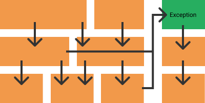
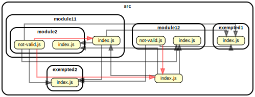

# no-upward-rule

This is a challenge I'm trying to solve but I'm bad at regex...

With `dependency-cruiser`, I would like to enforce this rule :

> All source dependency should point inwards

Visually it would look something like this (simplified):


## Rules

- [] 1. Each file can import any other file that is :
  - [] at the same level
  - [] nested in a folder from the same level

Example :
`index0` can import `index1` and `index2`.
`index1` can import `index2`.

```
+-- ...
    +-- index0
    +-- sub1
        +-- index1
        +-- sub2
            +-- index2
```

- [] 2. Each file cannot import any file that is above it's current level

Example :
`index0` can import `index1` and `index2`.
`index1` can import `index2`.

```
+-- ...
    +-- index0
    +-- sub1
        +-- index1
        +-- sub2
            +-- index2
```

- [] 3. Each file can import a file or sub file from exempted folders
  (Exempted folders should be hardcoded 😌)
- [] 4. Exempted folders follow the #1 rule internally (no upward imports)

## Expected

This is the graph expected :


To check if it's similar, run `gc:osage` package.json command.

## Exploration
The following are what I've trying. They may help you get started.

1. Try to extract the leading folder
```
These parts :

    src/module11/module2/index.js
$1  ^^^^^^^^^^^^^|      |
$2               ^^^^^^^^
```

Regex: 
```
^src\/(([^/]+\/)*)([^/]+\/){1}[^/].[^/.]+
```

Problems:
  - This does not scale well because of `{1}`.
  - How to enforce the rules after that ??

2. Reverse check
I capture everything before the last `/`.
Using that group, I forbid everything except all sub files and folders.

[Playground](https://regexr.com/4f2js)

```js
...
{
  name: "no-upward-imports",
  comment: "Don't allow dependencies to import parents",
  from: {
    path: "^src/(([^/]+/)*)[^/]+",
  },
  to: {
    pathNot: "^src/$1[^/]+",
  },
},
...
```
This command fails with an `unsafe regular expression. Bailing out.`.
